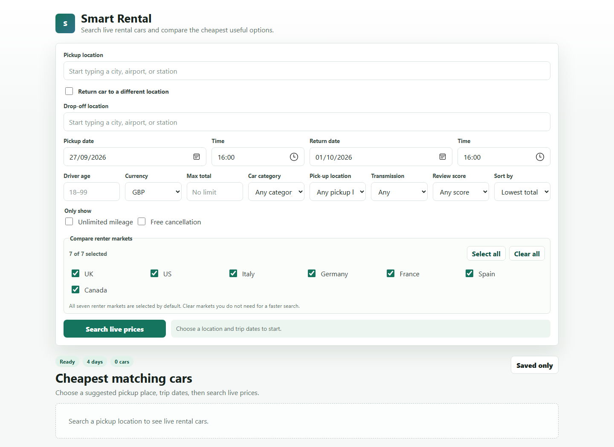

# Smart Rental

Smart Rental helps travellers find cheaper car rentals by comparing Booking.com prices for the same trip across supported country markets around the world. For every selected renter country, it repeats an identical search using the same locations, dates, times, driver age and currency. It then matches equivalent vehicles by supplier, category and pickup depot. The results highlight the lowest available price and show the price difference between markets, making it easy to see when Booking.com offers the same rental for less in another country. A server-side provider adapter handles the live RapidAPI searches while keeping API credentials out of the browser.

## Preview



## How it works

- The browser requests rental locations from `/api/locations`.
- The Node server calls `/car/auto-complete` and returns provider location IDs.
- A search calls `/car/search` once per selected `countryFlag`, with identical locations, dates, exact driver age, language, and currency. One-way searches include the selected `dropOffId`; driver ages from 18–99 are validated and passed through to provider pricing and Booking.com links.
- Results are normalized and matched by vehicle, category, supplier, and pickup address before their prices are compared.
- Results can be filtered locally using Booking.com's car categories (Small, Medium, Large, Estate, Premium, People carriers, or SUVs), pickup-location types (City centre, Train station, Shuttle bus, or In terminal), and supplier review score (7+, 8+, or 9+) without making another provider request. Choosing a suggestion labelled City Centre/Center selects the City centre depot filter automatically.
- Up to 500 offers per renter market are retained so price sorting does not discard most city-centre inventory before local filtering.
- Each result gets an opaque, short-lived quote ID. Opening **Review live quote** loads `/car/detail`, `/car/packages`, and `/car/booking-summary` on the server using the matching vehicle ID and search key.
- Each current result also gets a **Check latest price on Booking.com** link built from its fresh vehicle ID, trip, currency and winning renter market. Booking.com performs the final availability and price check.
- Quote cards note that Booking.com may apply further vehicle discounts based on the customer's account level; these are only confirmed on Booking.com.
- The quote dialog shows the provider's confirmed total, price breakdown, fees, inclusions, protection packages, trip summary, important information, and rental-terms link.
- The RapidAPI key stays on the server and is never sent to browser code.

## Setup

1. Subscribe to the `booking-com18` API on RapidAPI.
2. Copy the example environment file if `.env` does not exist.

```powershell
Copy-Item .env.example .env
```

3. Put your provider and RapidAPI key in `.env`.

```env
RENTAL_PROVIDER=booking-com18
RENTAL_API_KEY=your_key_here
```

4. Start the app.

```powershell
npm start
```

5. Open `http://localhost:3000`.

## Scripts

```powershell
npm start
npm run check
npm test
```

## Configuration

```env
RENTAL_PROVIDER=booking-com18
RENTAL_API_KEY=your_key_here
RENTAL_API_HOST=booking-com18.p.rapidapi.com
RENTAL_API_BASE_URL=https://booking-com18.p.rapidapi.com
RENTAL_API_AUTOCOMPLETE_PATH=/car/auto-complete
RENTAL_API_SEARCH_PATH=/car/search
RENTAL_API_DETAIL_PATH=/car/detail
RENTAL_API_PACKAGES_PATH=/car/packages
RENTAL_API_BOOKING_SUMMARY_PATH=/car/booking-summary
# BOOKING_AFFILIATE_ID=123456
PORT=3000
```

`RAPIDAPI_KEY` remains supported as a backwards-compatible fallback. The `RENTAL_API_*_PATH` settings let you switch hosts or endpoint paths without code changes when the replacement API uses the same request and response format.

## Changing rental APIs

The browser and the main server use a provider-neutral quote format. Provider-specific request parameters and response mapping live in `providers/`.

- If a replacement is compatible with `booking-com18`, update `RENTAL_API_HOST`, `RENTAL_API_BASE_URL`, the endpoint paths, and the key in `.env`.
- If its JSON or search flow differs, copy the shape of `providers/booking-com18.js`, implement the provider contract, and register it in `providers/index.js`. Then switching between installed adapters only requires changing `RENTAL_PROVIDER`.

Every adapter supplies its own configuration check, location search, pickup resolution, market search, search-key and offer extraction, offer normalization, live quote-detail loading, and (when supported) outbound booking URL creation. This keeps authentication and API changes out of the website, saved-quote, and comparison code.

## Notes

- Keep the display currency fixed when comparing countries; otherwise exchange-rate changes can look like market-price changes.
- The original seven renter markets are selected by default: UK, US, Italy, Germany, France, Spain, and Canada.
- Searches are limited to six simultaneous provider requests so comparisons do not create an uncontrolled request burst.
- Driver age is required and must be an exact whole number from 18 to 99 because it can change eligibility and pricing.
- The provider is an unofficial API that reproduces public Booking.com data. Treat its schema and availability as third-party dependencies and keep fixture tests for the fields the app consumes.
- Provider calls may consume RapidAPI quota. A search makes one call per selected renter market; the first detail view for a result makes three additional calls. Quote details are cached for 30 minutes.
- The provider does not return a checkout URL, so the adapter builds Booking.com's documented vehicle-result URL from the fresh vehicle ID and search context. The link preserves the displayed quote's renter country and currency, but Booking.com remains responsible for the final live price, availability and checkout.
